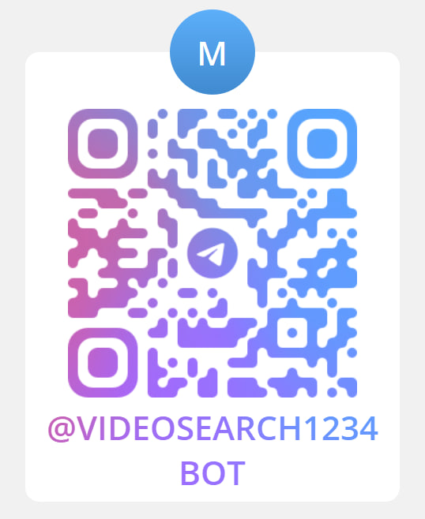

# 📦 Practice

## Опис
Цей проєкт є ботом для Telegram, який дозволяє шукати відео на YouTube, зберігати їх у список обраного та переглядати відео на основі ваших запитів. Бот використовує базу даних SQLite для зберігання інформації про користувачів та їхні обрані відео.

## 📋 Вимоги
- Python 3.x
- Бібліотеки: `sqlite3`, `telebot`, `logging`, `requests`

## 🚀 Використання
Для взаємодії з ботом користувач потребує встановленого Telegram.
Сценарії використання:
- Запуск бота (прецедент "Запуск програми"): Відкрийте Telegram і знайдіть бота за посиланням. Натисніть кнопку "Start".
- Пошук відео (прецедент "Пошук відео"): Введіть команду /search [тема]. Бот поверне список релевантних відео з короткими описами та кнопками для дій (перегляд або додавання у "Вибране").
- Додавання у "Вибране" (прецедент "Додавання у 'Вибране'"): Натисніть кнопку "Додати у Вибране" під обраним відео. Бот підтвердить успішне збереження.
- Перегляд "Вибраного" (прецедент "Перегляд 'Вибраного'"): Введіть команду /favorite. Бот поверне список збережених відео з кнопками для видалення чи перегляду.
- Отримання рекомендацій (прецедент "Перегляд рекомендацій"): Введіть команду /recommend. Бот згенерує список відео на основі ваших попередніх запитів.
- Отримання довідки (прецедент "Отримання допомоги"): Введіть команду /help. Бот надасть опис доступних команд і їхнього призначення.

## 🧩 Архітектура проєкту
Проєкт складається з наступних основних компонентів:
- `bot.py`: Основний файл бота, який містить логіку обробки команд та взаємодії з користувачами.
- `bot_database.db`: Файл бази даних SQLite, який зберігає інформацію про користувачів та їхні обрані відео.

## 📚 Документація
Для детальнішої інформації про використання та налаштування проєкту, будь ласка, зверніться до [документації](https://raw.githubusercontent.com/Anna28Krav/practice/refs/heads/main/%D0%97%D0%B2%D1%96%D1%82%20%D0%BF%D1%80%D0%B0%D0%BA%D1%82%D0%B8%D0%BA%D0%B0.docx).

## 🌟 Особливості
- Пошук відео на YouTube за допомогою API.
- Збереження результатів пошуку та обраних відео в базі даних.
- Інтерактивні кнопки для додавання та видалення відео з обраного.

## 📋 Команди бота
- /start - Початок роботи з ботом 
- /help - Отримати допомогу 
- /search - Пошук відео на YouTube 
- /favorite - Перегляд обраних відео 
- /recommend - Отримати рекомендації (поки в розробці) 

## 🛠️ Майбутні плани
- Додавання функції рекомендацій на основі історії пошуку.
- Покращення інтерфейсу користувача.
- Інтеграція з іншими платформами для розширення функціональності.

## 📞 Контакти
Для зворотного зв'язку та підтримки звертайтеся до автора проєкту:
- 👨‍💻 Автор: Кравченко Анна 
- 📧 Email: anna611552@gmail.com 

## 📅 Дата створення
25 грудня 2024 року

## 📱️ Демо

# @VideoSearch1234Bot

*Залишайтеся на зв'язку та користуйтеся всіма можливостями бота! 😊